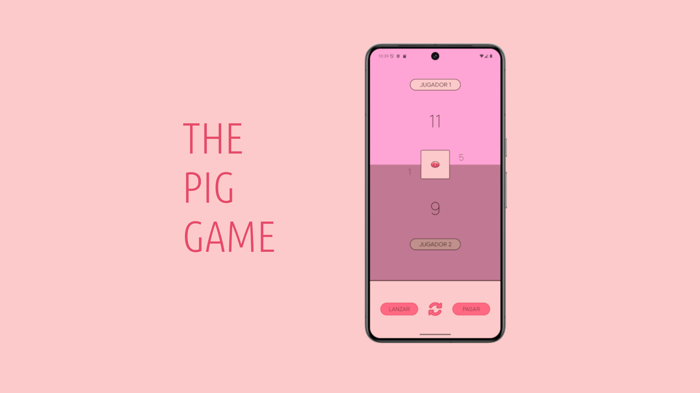

# 🐷 The Pig Game

**The Pig Game** es una sencilla implementación del clásico juego de dados para dos jugadores. Cada jugador lanza el dado tantas veces como quiera durante su turno, acumulando puntos. Si obtiene un 1, pierde el turno. El primero que alcance 100 puntos o más gana. 🎲🎉

---

## 🚀 Funcionalidades

- Lanzar dado y sumar puntos al jugador activo.
- Pasar el turno al siguiente jugador.
- Reiniciar partida para comenzar de nuevo.
- Visualización clara de puntos y turno activo.
- Animaciones para eventos especiales (sacar un 1, cambio de jugador).

---

## 🛠 Tecnologías y Librerías

  

- Lenguaje: Java
- ViewBinding para manejo eficiente de vistas
- SDK mínimo: 27
- SDK máximo: 35

---

## 🏗 Estructura del Proyecto

com.example.thepiggame/
│
├── logic/
│ └── ControladorJuego.java # Lógica del juego: gestión de jugadores, turnos y puntuaciones
│
├── model/
│ └── Jugador.java # Modelo que representa a cada jugador y su puntuación
│
├── util/
│ └── Dado.java # Dado con mapa de valores e imágenes, lanzamiento aleatorio
│
└── MainActivity.java # Actividad principal con la UI y lógica de interacción

---

## 🎮 Cómo usar

1. Clona o descarga el repositorio.
2. Abre el proyecto en Android Studio.
3. Ejecuta la app en un emulador o dispositivo con SDK 27 o superior.
4. ¡Diviértete lanzando dados y ganando partidas!

---